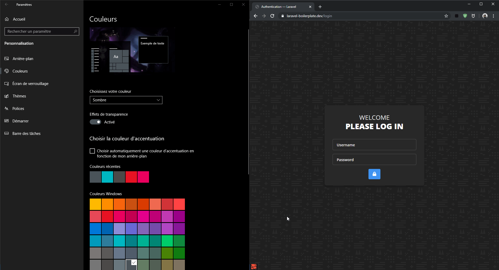

<p align="center">
  
</p>

# Table of contents

- [Configuration](#configuration)
- [Colors](#colors)
- [Variants](#variants)
    - [Opacity Variants](#opacity-variants)
    - [Color Variants](#color-variants)
- [Themes](#themes)
    - [Schemes](#schemes)
        - [Dark scheme](#dark-scheme)
        - [Light scheme](#light-scheme)
    - [Defaults and assignables](#defaults-and-assignables)
- [Strategies](#strategies)
    - [Using a strategy](#using-a-strategy)
    - [Prefixed](#prefixes)
    - [Reference](#strategy-reference)
- [Other](#other)
    - [Color variables' prefixes](#color-variables-prefixes)
    - [Themes shorthand](#themes-shorthand)
    - [Hexadecimal mode](#hexadecimal-mode)
- [← Back](../readme.md)

# Configuration

Let's configure a theme. For now, we'll just setup a main theme, without name, non-assignable. The default theme of your application. Let's start with the following boilerplate:

```js
// theme.config.js
const { ThemeBuilder, Theme } = require('tailwindcss-theming');
const mainTheme = new Theme();

module.exports = new ThemeBuilder()
  .default(mainTheme);
```

This configuration file will require `tailwindcss-theming` and create a new `Theme` object. For now, it's empty. A `ThemeBuilder` object is also created and the method `default` is called on it with our theme as a parameter. This will make this theme the default theme.

# Colors

The first thing to do is obviously to create the color palette. This plugin offer an abstract to the cumbersome way of manually assigning variable definition in Tailwind and custom properties in your CSS. 

To add a color, simply call `color(name, value)` on the `Theme` object. The `name` parameter will be used to determine the utility classes' names, and the `value` can be any color. You can pass a HEX code, a HEX8 code, a color name, and RGBA definition. The [TinyColor](https://github.com/typectrl/tinycolor) package is used to parse and convert it.

Let's add our brand colors. We want to be able to use it as a background and as a foreground. For instance, we want to be able to have some brand-colored text, but also have a section with the brand color as a background. 

```js
// theme.config.js
const { ThemeBuilder, Theme } = require('tailwindcss-theming');
const mainTheme = new Theme()
  .color('brand', '#2196f3')
  .color('on-brand', '#ffffff')
;

module.exports = new ThemeBuilder()
  .default(mainTheme);
```

Here, I created two colors instead of just one. The reason for this is that when we use the `brand` color as a background, we may also want to have text on it, right? In this case, we need to define a color that will render correctly on the background. To do so, I used the `on-<color>` naming convention.

Since calling `color()` for each color can be cumbersome, there is the `colors` method. You can call if with an object of names and values.

```js
// theme.config.js
const { ThemeBuilder, Theme } = require('tailwindcss-theming');
const mainTheme = new Theme()
  .colors({
    brand: '#2196f3',
    'on-brand': '#ffffff'
  })
;

module.exports = new ThemeBuilder()
  .default(mainTheme);
```

# Variants

Defining our own colors is a huge step, but Tailwind's default palette come with its load of shades. Unfortunately, having shades in a dark and light theming context is not a good idea. 

Instead, you can use `variants`. In this plugin, `variants` are not the same than in Tailwind. Here, a `variant` will be an alternative to a color. It can be an [opacity](#opacity-variants) variant or a plain [color](#color-variants) variant.

## Opacity variants

An `OpacityVariant` will simply change the `alpha` value of a color. For instance, an opacity variant named `muted` with the value `0.35` will create a `.text-primary-muted` utility which color property will be `color: rgba(var(--color-primary), var(--opacity-variant-muted))`. This variant will be available for a `primary` color.

To define an opacity variant, call `opacityVariant` on a `Theme` object.

```javascript
new Theme()
  .colors({
    primary: '#2196f3',
  })
  .opacityVariant('muted', .35, 'primary');
```

The first and second parameters are the `name` and the `value` of that variant, while the third parameter is optional and can indicate which color the variant must be available for. If omitted, the variant will be available for every color. This parameter can be a simple `string` for one color, or an `array` of `string` for multiple colors.

## Color variants

Sometimes, you can't get the result you want with just an opacity tweak, so you would maybe want to change the whole color. A `ColorVariant` is available for this purpose.

As an example, a color variant named `hover` which value is `#3B4252` will generate a `.text-primary-hover` utility which color property will be `color: rgb(var(--color-variant-hover))` for a variable named `property`. 

This utility would completely replace `primary`'s color. You could achieve the same result with declaring another color, but the goal is to use the utility classes.

To define a color variant, call `colorVariant` on a `Theme` object.

```javascript
new Theme()
  .colors({
    primary: '#2E3440',
  })
  .colorVariant('hover', '#3B4252', 'primary');
```

As for the opacity variants, a color variant can be scoped to specific colors by passing a `stirng` or an `array` of `string` as the third parameter.

# Themes

Now that you know how to declare your color palette, let's talk about themes. The purpose of this plugin is to be able to define multiple themes. To do so, you can call the `theme` method on the `ThemeBuilder` object to add an other theme.

```js
// theme.config.js
const { ThemeBuilder, Theme } = require('tailwindcss-theming');
const mainTheme = new Theme();
const darkTheme = new Theme()
    .name('dark');

module.exports = new ThemeBuilder()
  .default(mainTheme)
  .theme(darkTheme);
```

As you probably guessed, we now have two themes, in which one if the default. The default theme will be declared in the `:root` CSS selector, while the other themes' declaration will depend on the configuration. 

**Be careful** in your color declarations. Only the declarations of the default theme will be taken into account. It means that if you have a `tertiary` color on a `dark` theme but not on the default theme, it will not be generated at all. This is by design in order to keep color palettes consistent between themes.

## Schemes

This plugin can make use of the [`prefers-color-scheme`](https://developer.mozilla.org/fr/docs/Web/CSS/@media/prefers-color-scheme) media query to deliver a theme corresponding to an user's OS configuration.

Here you can see an example of this media query. In the right, a website is using `prefers-color-scheme` to deliver a theme based on an OS' preferences. You can see that the site's scheme changes as the OS' settings are modified.



Let's declare a dark theme.

### Dark scheme

In order to make a theme the dark scheme's default theme, you only need to call `dark()` and `default()` on it. 

```js
// theme.config.js
const { ThemeBuilder, Theme } = require('tailwindcss-theming');
const mainTheme = new Theme();
const darkTheme = new Theme()
  .dark()
  .default();

module.exports = new ThemeBuilder()
  .default(mainTheme)
  .theme(darkTheme);
```

The `dark()` method will indicate that the theme declaration needs to be under the `prefers-color-scheme: dark` media query. The `default()` method sets the theme as the default for its current configuration. In other terms, it indicates that the theme's colors and variables have to be declared in a `:root` CSS selector. 

Just like the `default()` method on the `ThemeBuilder` object, a `dark()` method is available as well. 

```js
module.exports = new ThemeBuilder()
  .default(mainTheme)
  .dark(darkTheme, true, false);
```

The second argument defines whether or not this theme is the default. It's `true` by default. The third argument defines if the theme must be assignable. It's also `true` by default. More on that assignable property later.

### Light scheme

Setting up a light theme is about as simple. Just call `light()` and `default()`.

```js
// theme.config.js
const { ThemeBuilder, Theme } = require('tailwindcss-theming');
const mainTheme = new Theme();
const darkTheme = new Theme()
  .dark()
  .default();
const lightTheme = new Theme()
  .light()
  .default();

module.exports = new ThemeBuilder()
  .default(mainTheme)
  .theme(darkTheme);
  .theme(lightTheme);
```

Just like the `dark` themes, a `light()` method with the same parameters is available on the `ThemeBuilder` object.

## Defaults and assignables

When a theme is defined as the default theme, it will its CSS selector will be `:root`. For instance, the application's default theme will be `:root`, and the application's default *dark* theme will be `:root` under the `prefers-color-scheme: dark` media query. That's the reason the themes are able to be determined automatically. 

But sometimes, a user without that `prefers-color-scheme` preference may want to use the `dark` theme. For this reason, you can make a default theme `assignable`. To do so, simply call the `assignable()` method on it.

```js
// theme.config.js
const { ThemeBuilder, Theme } = require('tailwindcss-theming');
const mainTheme = new Theme();
const darkTheme = new Theme()
  .name('dark')
  .dark()
  .default()
  .assignable();

module.exports = new ThemeBuilder()
  .default(mainTheme)
  .theme(darkTheme);
```

When `assignable`, a theme will *always* have a CSS declaration of the theme's name. If the theme is also a default theme, its declaration will be duplicated into `:root` and its declaration strategy. In the example above, the following CSS will be generated:

```css
:root { /* ... */ }
[dark] { /* ... */ }
```

Note that we declared a `name` on the theme. You need to do so when you want a theme to be `assignable`.

# Strategies

Not everyone like the same way to use themes. For this reason, this plugin can generate the CSS for your themes in multiple strategies. Each strategy will only change the selector you need to apply to use your theme. Moreover, the strategy is application-wise and not theme-wise: the same strategy will be used for all themes. 

To have an overview of the strategies available, please read the [strategy reference](#strategy-reference).

### Using a strategy

There are two ways of using a strategy. Either you call `strategy(name)` on the `ThemeBuilder` object, where `name` is the name of the strategy (see [reference](#strategy-reference)), or you can call the `asStrategyName()` method without parameter on the `ThemeBuilder` object. The method name will obviously change for each strategy.

In the following example, the themes will be exported as `data-attributes`, that is to say, in the form of a `[data-<name>]` CSS selector.

```js
// theme.config.js
const { ThemeBuilder, Theme } = require('tailwindcss-theming');
const mainTheme = new Theme();
const darkTheme = new Theme()
  .dark()
  .default();

module.exports = new ThemeBuilder()
  .asDataAttribute()
  .default(mainTheme)
  .theme(darkTheme);
```

The default strategy if you don't specify one is the `attribute` strategy.

### Prefixes

The `ThemeBuilder` object have a `prefix()` method which defines the prefix used for certain strategies. For instance, calling `.prefix('palette')` on `ThemeBuilder` and using the `prefixed-class` attribute will generate the selector `.palette-dark` for a theme named `dark`. 

The `prefixed-class` and `prefixed-attribute` make use of this property.

### Strategy Reference

| Method | Name | Enum Access | Description |
| ------ | ---- | ---- | ----------- |
| `asPrefixedClass()` | `prefixed-class` | `Strategy.PrefixedClass` | Each theme will be exported in a class with a prefix. You will be able to use a theme by applying the class `.<choosenPrefix>-<themeName>` on a node. The CSS rule will be `.<choosenPrefix>-<themeName>`. | 
| `asClass()` | `class` | `Strategy.Class` | Each theme will be exported in a class. You will be able to use a theme by applying the class `.<themeName>` on a node. The CSS rule will be `<themeName>`. | 
| `asDataAttribute()` | `data-attribute` | `Strategy.DataAttribute` | Each theme will be exported as a data-attribute. You will be able to use a theme by setting the attribute `data-<themeName>` on a node. The CSS rule will be `[data-<themeName>]`. | 
| `asPrefixedAttribute()` | `prefixed-attribute` | `Strategy.PrefixedAttribute` | Each theme will be exported as an attribute with a prefix. You will be able to use a theme by setting the attribute `<choosenPrefix>-<themeName>` on a node. The CSS rule will be `[<choosenPrefix>-<themeName>]`. | 
| `asAttribute()` | `attribute` |  `Strategy.Attribute` | Each theme will be exported as an attribute. You will be able to use a theme by setting the attribute `<themeName>` on a node. The CSS rule will be `[<themeName>]`. |
| `asDataThemeAttribute()` | `data-theme-attribute` |  `Strategy.DataThemeAttribute` | Each theme will be exported as a data-theme attribute. You will be able to use a theme by setting the attribute `data-theme` with the value `<themeName>` on a node. The CSS rule will be `[data-theme=<themeName>]`. |

# Other

## Color variables' prefixes

If for some reason you need or want to change the color variables' prefixes, you can use `colorVariablePrefix('prefix')` to change it. You can remove it completely by not passing any parameter, but it could potentially break up things if you have another variable of the same name. 

```javascript
import { ThemeBuilder } from 'tailwindcss-theming';

const theme = new ThemeBuilder()
    .colorVariablePrefix('color');

// Will output `--color-primary` for a variable named `primary`.

const theme = new ThemeBuilder()
    .colorVariablePrefix();

// Will output `--primary` for a variable named `primary`.
```

## Themes shorthand

You can declare multiple themes at once by calling `themes()` on the `ThemeBuilder` object. The only parameter is an array of `Theme` objects. If you are using this, don't forget to have at least one default theme in the array. 

## Hexadecimal mode

If you don't want to deal with RGB or RGBA, you can enable the hexadecimal mode, which will use the HEX8 format. **It will disable opacity variants**, but color variants will still be available. 

For instance, the following theme:

```javascript
new Theme()
  .colors({
    primary: 'white',
  })
  .opacityVariant('hidden', 0)
  .colorVariant('hover', '#3B4252', 'primary');
```

Will output the `--color-primary: #ffffffff` variable in `:root`, as well as the `--color-variant-primary-hover: #3B4252FF` variant, but the `hidden` opacity variant will be ignored. No utility nor variable will be generated. 

This mode will allow you to work with inline variable in an easier way. For instance, you will be able to change your brand color this way:

```html
<div style="--color-brand: #ff00ff">
    <!-- ... -->
</div>
```

Instead of this way:

```html
<div style="--color-brand: 255,0,255">
    <!-- ... -->
</div>
```
