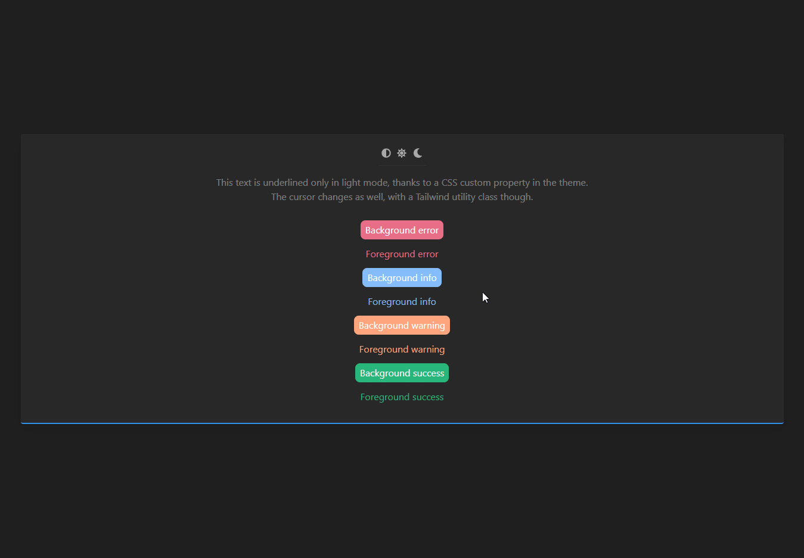

<p align="center">
  <a href="#"></a>
  <br>
  <div align="center">
  <a href="https://github.com/hawezo/tailwindcss-theming/releases" target="_blank"></a>
  <a href="https://npmjs.com/package/tailwindcss-theming" target="_blank"></a>
  <a href="https://npmjs.com/package/tailwindcss-theming" target="_blank"></a>
  
  
  </div>
  <br>
</p>

# Table of contents

- [Introduction](#introduction)
- [Setup](docs/setup.md)
- [Usage](docs/usage.md)
- [Configuration](docs/configuration.md)
    - [Colors](docs/configuration.md#colors)
    - [Variants](docs/configuration.md#variants)
    - [Themes](docs/configuration.md#themes)
    - [Strategies](docs/configuration.md#strategies)
- [Extending Tailwind and custom variables](docs/extending.md)
    - [Adding variables](docs/extending.md#adding-variables)
    - [Extending Tailwind](docs/extending.md#extending-tailwind)
- [API reference](docs/reference.md)
  - [ThemeBuilder](docs/reference.md#theme-builder)
  - [Theme](docs/reference.md#theme)
- [Examples](docs/examples.md)
    - [Configuration](docs/examples.md#configuration)
    - [Application](docs/examples.md#application)
- [Compatibility](#compatibility)


# Introduction

> **Note** - This plugin works with [**Tailwind CSS v1.2**](https://github.com/tailwindcss/tailwindcss/releases/tag/v1.2.0) upwards.
> There is an unmaintained version of this plugin available for Tailwind CSS v1.1. Check out the [`tailwind-1.1`](https://github.com/hawezo/tailwindcss-theming/tree/tailwind-1.1) branch.

`tailwindcss-theming` is a Tailwind plugin made to solve the common need to have multiple themes in an application. It is also perfect for making dark themes.

It uses [CSS custom properties](https://developer.mozilla.org/en-US/docs/Web/CSS/--*) in order to make your themes changeable on the client-side. Swapping themes is as simple as changing the class of your `body` or `html` element. 

Moreover, this plugin fully supports the [`prefers-color-scheme`](https://developer.mozilla.org/fr/docs/Web/CSS/@media/prefers-color-scheme) media query, so you can setup a theme that will be automatically picked based on browser preferences.

**Get started:**

```console
$ yarn add tailwindcss-theming --dev
```


# Compatibility

Please note that IE11 [doesn't support CSS custom properties](https://caniuse.com/#feat=css-variables). You can still have partial support for IE11 by using the [PostCSS custom properties plugin](https://github.com/postcss/postcss-custom-properties). 

You won't be able to change theme at runtime, but at least your main and  theme will work flawlessly.

<p align="center">
    <br />
    •
    <br />
    <br />
    
    <i>A dark/light mode switch example - see <a href="docs/examples.md#application">here</a>.</i>
</p>
